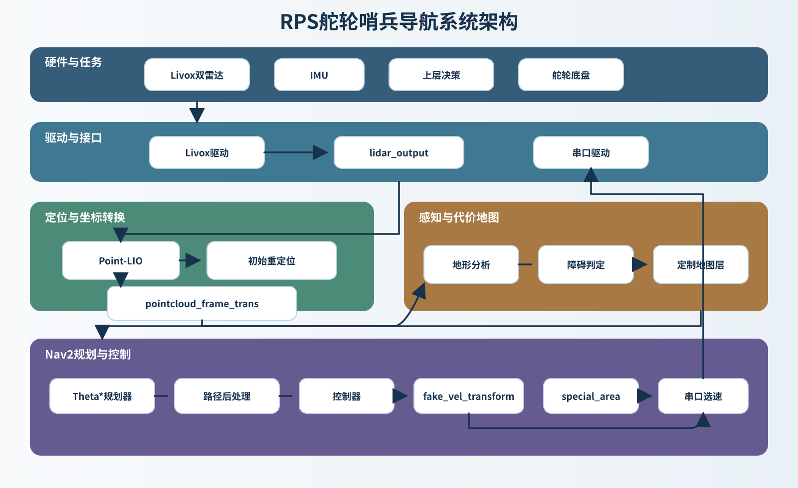
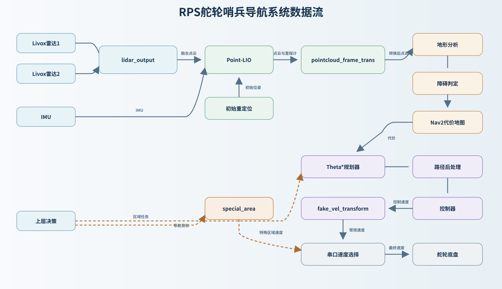

<p align="center">
  
</p>

# RPS舵轮哨兵导航系统

## 项目介绍

  本项目是一个基于Nav2框架、面向RoboMaster哨兵机器人的ROS2导航项目，由我作为RPS战队成员开发。系统以二维代价地图为基础，在有限算力下完成定位、感知、规划与控制，主要追求轻量化和实车运行的稳定性。

  项目面向单计算设备同时运行两台雷达、四台相机和完整导航链路的实际需求，对Point-LIO、感知和规划控制链路进行了轻量化处理。规划部分没有采用近期RM中常见的MINCO等多项式轨迹方案，而是保留离散路径，并通过路径缓存、后端平滑和跟踪控制提高运行稳定性。

  当前版本在第13代Intel Core i7 NUC上仅运行导航链路时，CPU占用率低于10%。

  这个项目从本赛季开始开发，至今不足一年。开始开发前我没有ROS2使用经验，项目也几乎完全从零搭建，因此目前仍不够成熟和完善。后续会持续更新。

  详细实现说明见[技术文档](docs/technical_document.md)。PDF版本保存在`docs`目录中，可下载后阅读。

## 效果展示

[地形跨越效果](https://www.bilibili.com/video/BV1HQ8c6HE2r/)

## 项目结构

以下结构列出当前开源源码中的主要目录和模块。

```text
.
├── README.md
├── docs/
│   ├── technical_document.md        # 技术文档源文件
│   └── technical_document.pdf       # 技术文档PDF版本
├── start/                           # 构建、启动和systemd示例脚本
└── src/
    ├── bringup/                     # Launch、参数、地图、RViz与行为树
    ├── rm_hardware_driver/
    │   ├── lidar_output/            # 双雷达数据融合
    │   └── livox_ros_driver2_humble/# Livox ROS2驱动
    ├── rm_interfaces/               # 项目自定义ROS2消息
    ├── rm_localization/
    │   ├── point_lio/               # 优化后的Point-LIO
    │   ├── small_gicp_relocalization/# 基于small_gicp的重定位
    │   └── map_save/                # 周期性地图保存
    ├── rm_navigation/
    │   ├── theta_star_planner/      # 全局离散路径规划
    │   ├── rps_omni_controller/     # 全向底盘路径跟踪
    │   ├── constraint_vel_controller/# 未实际使用的MPPI控制器
    │   ├── fake_vel_transform/      # 速度及坐标系适配
    │   └── move_to_free/            # 脱困恢复行为
    ├── rm_perception/
    │   ├── terrain/                 # 地形分析与高程障碍点云
    │   ├── pointcloud_frame_trans/  # 点云和里程计坐标适配
    │   ├── pc2scan/                 # 点云转二维激光扫描
    │   ├── voxel_obstacle/          # 定制体素障碍层
    │   ├── static_xx_layer/         # 比赛区域静态代价地图层
    │   ├── special_area/            # 特殊场地区域处理
    │   └── omni_perception/         # 全向感知信息适配
    └── rm_port/
        └── rm_serial_driver-main/   # 导航系统与底盘控制器通信
```

### 系统架构图

<p align="center">
  
</p>

### 数据流图

<p align="center">
  
</p>

## 启动配置

项目保留三个相互独立的顶层启动文件，便于针对调试和实车部署分别增删模块：

| 启动文件 | 用途 | 默认参数文件 |
|---|---|---|
| `c_reloc_bringup_launch.py` | rosbag与日常调试 | `nav_params_1.yaml` |
| `nav_launch.py` | 实车开机自启主配置 | `nav_params.yaml` |
| `nav2_launch.py` | 实车备用配置 | `nav_params_1.yaml` |

主要可选参数：

| 参数 | 作用 |
|---|---|
| `mapping_mode` | 是否启动`pc2scan`和`slam_toolbox`建图链路 |
| `relocate` | 是否启动`small_gicp_relocalization` |
| `use_rviz` | 是否启动RViz |
| `use_omni_perception` | 是否启动全向感知模块 |
| `use_map_save` | 是否周期性保存地图 |
| `map_save_path` | 周期地图保存的输出前缀，默认为`~/sentry26_maps/map` |
| `use_decision` | 是否启动队内决策节点；未安装`rm2026_decision`时默认关闭 |
| `use_sim_time` | 是否使用`/clock`仿真时间 |

## 环境与构建

当前开发环境：

- Ubuntu22.04
- ROS2 Humble
- CMake/colcon
- Livox MID-360系列雷达

克隆后安装依赖：

```bash
cd ~/sentry26
rosdep install --from-paths src --ignore-src -r -y
```

编译：

```bash
colcon build --symlink-install --cmake-args -DCMAKE_BUILD_TYPE=Release
source install/setup.bash
```

## 实车部署

首次部署到机器人前，需要根据实际雷达、NUC网络和机械安装位置修改配置，仓库中的IP地址与外参仅适用于当前车辆。

### 雷达驱动配置

Livox驱动读取[`src/bringup/config/mid360_user_config.json`](src/bringup/config/mid360_user_config.json)。部署时至少需要修改：

- `host_net_info`中的IP为NUC连接雷达网卡的静态IP；
- `lidar_configs`中的`ip`为每台雷达的实际IP；
- 确保NUC与雷达处于同一网段，且配置中的数据端口没有被其他程序占用；
- [`nav_params.yaml`](src/bringup/config/nav_params.yaml)和[`nav_params_1.yaml`](src/bringup/config/nav_params_1.yaml)中的`user_config_path`指向该配置文件。

本项目的双雷达PTP软同步在NUC机器人运算平台上完成。实车启动前应先确认时间同步配置正常，再检查两台雷达消息的时间戳是否稳定。

公开仓库不包含队内的`rm2026_decision`。`nav_launch.py`和`nav2_launch.py`会在启动时检测该包：未安装时自动关闭决策节点，其余导航模块仍可正常启动；

### 雷达外参与静态坐标变换

静态TF集中定义在[`localization_launch.py`](src/bringup/launch/include/localization_launch.py)。更换雷达安装位置或移植到其他机器人时，需要重新测量并修改：

- `lidar_link`到`lidar_link_1`：第二台雷达相对第一台雷达的外参；
- `lidar_link`到`base_link`：主雷达与机器人底盘坐标系之间的外参；
- 与当前定位坐标定义相关的`odom`到`odom_init`变换。

参数按照`x、y、z、roll、pitch、yaw`填写，其中平移单位为米，旋转单位为弧度。

### 双雷达与单雷达切换

双雷达模式下，在`mid360_user_config.json`的`lidar_configs`中保留两台雷达，并在所用参数文件中设置：

```yaml
livox_ros_driver2:
  ros__parameters:
    multi_topic: 1
```

此时两台雷达分别发布独立话题，`lidar_output`完成帧级软同步、时间基准校正和外参变换，最后发布Point-LIO使用的`/livox/lidar`。

单雷达模式下，只在`lidar_configs`中保留实际使用的那台雷达，并将`multi_topic`改为`0`：

```yaml
livox_ros_driver2:
  ros__parameters:
    multi_topic: 0
```

驱动会直接发布`/livox/lidar`，Point-LIO可以继续使用原订阅话题。此时`lidar_output`收不到双路输入，不会发布融合点云；如需彻底关闭该空闲节点，可在[`localization_launch.py`](src/bringup/launch/include/localization_launch.py)中移除或注释`lidar_output`对应的`Node`。同时确认`lidar_link`所代表的是当前保留雷达，并按该雷达重新设置`lidar_link`到`base_link`的静态外参。

完成修改后重新编译并加载环境：

```bash
colcon build --symlink-install --cmake-args -DCMAKE_BUILD_TYPE=Release
source install/setup.bash
```

如需设置开机自启，可将`start/nav@.service`安装为systemd模板服务，并用实际Linux用户名实例化。例如仓库位于`~/sentry26`且用户名为`rps`时，启用`nav@rps.service`。模板会根据用户名解析用户主目录，不再依赖写死的路径。

## 运行

日常调试：

```bash
ros2 launch bringup c_reloc_bringup_launch.py
```

实车导航：

```bash
ros2 launch bringup nav_launch.py
```

按需组合功能：

```bash
ros2 launch bringup nav_launch.py \
  mapping_mode:=false \
  relocate:=true \
  use_rviz:=true \
  use_omni_perception:=false \
  use_map_save:=false
```

使用rosbag时需要播放时钟，并确保启动文件启用仿真时间：

```bash
ros2 bag play <bag-path> --clock
ros2 launch bringup c_reloc_bringup_launch.py use_sim_time:=true
```

## 参考与致谢

本项目在开发过程中参考了以下开源项目和技术资料，在此向相关作者与团队表示感谢：

- [SMBU PolarBear Robotics Team：pb2025_sentry_nav](https://github.com/SMBU-PolarBear-Robotics-Team/pb2025_sentry_nav)
- [Yancey2023：small_point_lio](https://github.com/Yancey2023/small_point_lio)
- 中国科学技术大学RoboWalker战队《2025赛季哨兵技术报告》
