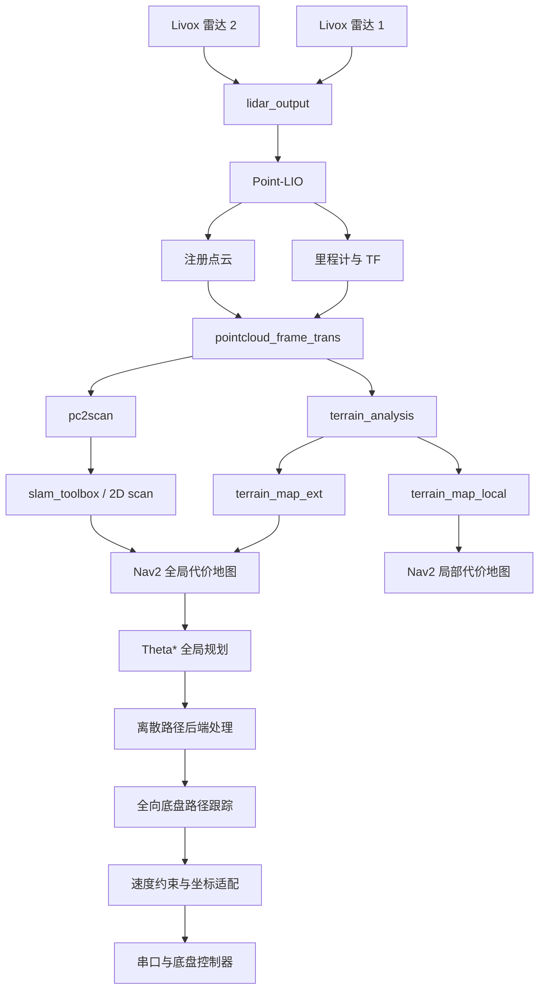

# Sentry26 架构说明（初版）

本文档描述 Sentry26 当前的设计目标、模块边界和数据流。它是一份开源前的初版
架构文档，主要用于建立统一目录；具体算法、参数和实验结果将在各模块文档中
补充。

## 1. 项目目标

Sentry26 面向 RoboMaster 哨兵机器人。系统需要在单台计算设备上同时承担双雷达、
多相机、定位、感知、规划、控制和通信任务，因此设计重点不是追求单个算法的
最大复杂度，而是在有限计算预算中获得稳定、可复现的整机表现。

当前主要目标包括：

1. 在二维 Nav2 代价地图体系中表达真实场地的障碍与特殊区域。
2. 提升机器人经过坡面、起伏连接处和下台阶时的导航稳定性。
3. 保持定位与导航链路轻量，给四相机感知任务保留足够计算资源。
4. 使用离散路径完成全局规划、后端处理与底盘跟踪，避免引入计算成本较高的
   MINCO + MPC 连续多项式轨迹链路。
5. 让调试配置与实车配置保持独立，便于逐模块启停和 rosbag 复现。

## 2. 总体数据流

该图只表达主要导航链路。相机目标感知、比赛决策和裁判系统通信将在后续文档中
单独描述。

## 3. 模块边界

### 3.1 硬件与标定

| 模块 | 职责 |
|---|---|
| `livox_ros_driver2` | 雷达数据接入 |
| `lidar_output` | 两台雷达的时间同步、坐标变换与融合输出 |
| `calib` | 多雷达外参标定 |

### 3.2 定位

| 模块 | 职责 |
|---|---|
| `point_lio` | 激光惯性里程计、注册点云和地图维护 |
| `small_gicp_relocalization` | 按需进行全局点云重定位 |
| `map_save` | 按需周期保存二维地图 |

定位启动文件中的两个模式开关彼此独立：

- `mapping_mode` 仅控制 `pc2scan` 和 `slam_toolbox`；
- `relocate` 仅控制 `small_gicp_relocalization` 及其所需 TF。

Livox 驱动、双雷达融合、Point-LIO 和基础定位节点不应由这两个开关连带关闭。

### 3.3 感知与二维环境表达

| 模块 | 职责 |
|---|---|
| `pointcloud_frame_trans` | 将点云和里程计适配到导航使用的坐标系 |
| `terrain_analysis` | 维护局部地形并发布高程障碍点云 |
| `pc2scan` | 为二维建图生成激光扫描数据 |
| `voxel_obstacle` | 动态体素障碍物过滤和代价地图更新 |
| `static_xx_layer` | 按比赛任务维护静态或可清除区域 |
| `special_area` | 特殊场地区域识别与状态处理 |
| `omni_perception` | 按需接入全向视觉感知结果 |

地形模块的详细输入、过滤链、话题和参数含义将在独立文档中补充。尤其需要说明
`terrain_map_ext` 并不是原始地面点云，而是经过高度差、连通性和时间衰减过滤
后的地形障碍点。

### 3.4 规划与控制

| 模块 | 职责 |
|---|---|
| `theta_star_planner` | 在二维代价地图上生成离散全局路径 |
| `pb_omni_pid_pursuit_controller` | 面向全向底盘的路径跟踪 |
| `constraint_vel_controller` | 速度和运动约束 |
| `fake_vel_transform` | 速度指令和底盘坐标系适配 |
| `move_to_free` | 从占用或受限区域恢复到可行空间 |

本项目保留离散路径表示。后续文档需要进一步说明路径重用、安全检查、后端优化、
局部跟踪和约束控制之间的关系。

### 3.5 系统集成

| 模块 | 职责 |
|---|---|
| `bringup` | 顶层启动、参数、地图、RViz 和行为树 |
| `rm_interfaces` | 项目自定义消息接口 |
| `rm_serial_driver` | 导航系统与底盘控制器通信 |

## 4. 启动配置

三个顶层 Launch 文件相互独立，避免为了复用代码而让调试配置和实车配置强耦合。

### `c_reloc_bringup_launch.py`

用于日常调试和 rosbag 回放。默认启用 RViz，使用仿真时间和调试参数文件。

### `nav_launch.py`

实车开机自启主入口。默认关闭 RViz，保留正式运行需要的地图保存和导航链路。

### `nav2_launch.py`

另一套实车参数入口，便于在不修改主配置的情况下切换传感器或导航参数。

每个顶层文件都应能独立决定下列可选功能：

- RViz；
- 全向感知；
- 地图保存；
- 二维建图；
- small_gicp 重定位。

## 5. 轻量化策略

目前可以公开描述的整体方向包括：

- 以单机整套系统帧率为优化目标，而不是只优化单节点峰值性能；
- 降低 Point-LIO 数据处理和地图维护开销；
- 在感知链路中尽早完成范围裁剪、降采样和时间衰减；
- 使用二维代价地图承载导航决策，避免引入不必要的三维规划开销；
- 使用离散路径与轻量跟踪控制，减少连续轨迹优化的计算负担；
- 将 RViz、地图保存、全向感知、建图和重定位设计为可选功能。

具体优化项、消融结果和性能数据需要在后续 Point-LIO、感知及规划控制文档中给出。

## 6. 性能记录

当前参考平台为第 13 代 Intel Core i7 NUC。在当前参数和 Release 编译下，仅运行
导航链路时观察到 CPU 占用率低于 10%。正式 benchmark 至少需要补充：

| 项目 | 待记录内容 |
|---|---|
| CPU | 型号、核心数、频率策略、各节点及整机占用 |
| 内存 | 启动稳定后 RSS、峰值内存 |
| 雷达 | 型号、数量、点频、发布频率 |
| 相机 | 数量、分辨率、推理帧率 |
| 定位 | 更新频率、延迟、漂移或重定位误差 |
| 规划控制 | 规划周期、控制频率、路径跟踪误差 |
| 地形测试 | 坡度、起伏高度、台阶高度、通过成功率 |
