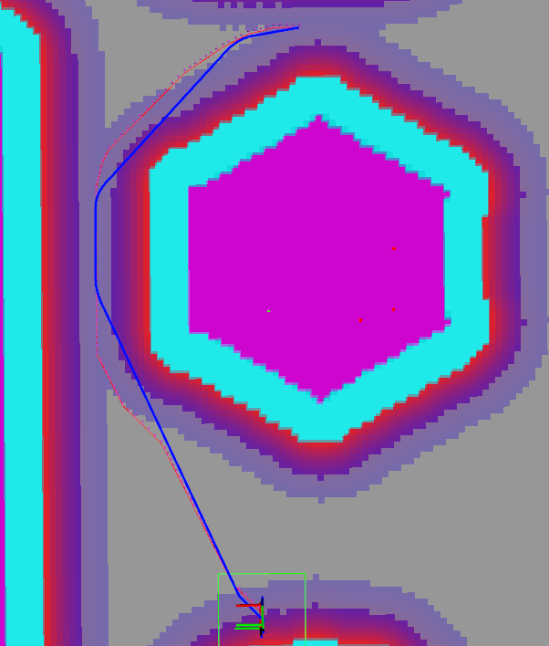

# 技术文档

本文档记录RPS舵轮哨兵导航系统当前已经实现的主要技术方案。项目基于Nav2构建，设计优先级是轻量化与实车稳定性。由于RoboMaster比赛场地具有较强的先验信息，部分区域坐标、任务条件和地形跨越逻辑采用了针对当前赛场的工程化配置或硬编码，这些内容并不以通用性为首要目标。

## 1.驱动和双雷达融合

### 1.1雷达驱动

系统使用两台Livox雷达提供点云。PTP软同步运行在运算平台上，使两台设备的数据处于基本一致的时间尺度，而不是在雷达侧完成同步处理。驱动输出保留Livox自定义点云中的`timebase`和每个激光点的`offset_time`，为后续运动补偿提供点级时间信息。

融合节点不会简单拼接两帧点云。两台雷达即使经过PTP同步，仍可能存在稳定的相对时钟偏移和配帧抖动，因此融合过程继续进行帧级同步与点级时间基准校正。

### 1.2帧级软同步

`lidar_output`使用ROS2`message_filters`中的`ApproximateTime`策略进行帧级软同步。`sync_queue_size`控制等待队列长度，`sync_max_delay`限制允许配对的最大时间间隔。与要求时间戳完全相等的同步方式相比，ApproximateTime能够容忍通信和调度产生的小幅抖动，同时又可以通过最大时间间隔避免相距过远的帧被合并。

### 1.3在线时钟偏移估计

每组配对点云到达后，节点根据两帧Livox`timebase`计算测量偏移：

```text
measured_offset=lidar2.timebase-lidar1.timebase
```

首次配对时使用测量值初始化双雷达相对时钟偏移，后续使用指数低通滤波在线更新：

```text
estimated_offset+=rebase_alpha*(measured_offset-estimated_offset)
```

该处理保留了长期时钟偏移的缓慢变化，同时抑制ApproximateTime配帧和消息调度造成的瞬时抖动。若一次测量相对当前估计的跳变量超过`rebase_max_jump`，节点将其视为疑似错配帧并拒绝更新和融合，防止错误样本污染时钟估计。

### 1.4软件时钟rebase

得到相对时钟偏移后，第二雷达的`timebase`先减去估计偏移，映射到第一雷达的时钟域。节点选择两路校正后帧起始时刻的较小值作为融合点云的统一`timebase`，再逐点重算两台雷达的`offset_time`：

```text
new_offset_time=corrected_source_timebase-output_timebase+old_offset_time
```

这样输出点云中的所有点都以同一个时间原点表达，Point-LIO读取`timebase+offset_time`时能够正确恢复每个点的采样时刻，避免两台雷达的点在同一帧中仍处于不同时间基准。

实现中还会拒绝`timebase=0`、负输出时间和`offset_time`溢出等异常数据。非法点只会被跳过；若融合后没有有效点，则整帧不发布。

### 1.5坐标统一与前置过滤

第二雷达点云通过TF变换到统一的`target_frame_id`后再参与融合，变换只在首次成功获取后缓存，减少每帧查询开销。两路点云还在融合前执行近距离和车体自遮挡区域过滤，既减少无效点进入定位链路，也避免机器人自身结构形成稳定伪障碍。输出消息会重新计算`point_num`，并一次性预留两帧点数之和所需的容器空间，降低融合过程中的重复内存分配。

## 2.定位和建图

### 2.1轻量化Point-LIO

定位以Point-LIO为基础，并参考中国科学技术大学Batch-LIO和ACE`small_point_lio`中的处理思路进行修改。当前版本仍保留Point-LIO逐点时间处理和激光惯性状态估计的主体，但围绕地图组织、增量插入、点云预处理和非必要输出做了面向整机资源预算的调整。目标不是单独追求定位节点的最高精度，而是在两台雷达、四台相机和完整Nav2链路并行运行时维持稳定频率。

为了控制计算量，定位链路没有引入因子图进行后端优化，而是采用Point-LIO的滤波式激光惯性里程计。系统在启动时完成一次初始重定位，之后主要信任Point-LIO连续输出的里程计结果，不再持续进行全局图优化。这一选择降低了定位链路的资源占用和实现复杂度。

修改后的定位链路显著降低了计算和内存占用，为同一计算设备上的相机感知和Nav2保留资源。新增地图点需要经过跨帧重复观测确认后才会写入地图，以减少瞬时噪声对地图的污染。

### 2.2异常IMU数据过滤

IMU回调在数据进入初始化和状态估计队列前进行有效性检查：

- 角速度和线加速度任一分量出现`NaN`或无穷值时直接丢弃；
- 任一角速度分量超过允许上限时直接丢弃；
- 任一线加速度分量超过允许上限时直接丢弃；
- IMU时间戳回退时清理缓存，避免乱序数据继续参与积分。

该过滤用于阻止驱动或传感器瞬时异常将非法数值传播到滤波器。相比在状态已经发散后恢复，在输入边界直接拒绝异常数据更简单，也更符合实车稳定性优先的目标。

### 2.3PCD保存保护

PCD保存支持按指定雷达帧数分批写盘，文件名包含递增编号和保存时刻的位姿信息。写入前会检查文件是否已经存在并自动选择新的编号，因此程序重启后不会覆盖之前保存的PCD。

### 2.4初始重定位

`small_gicp_relocalization`只在程序启动后的初始位置执行一次重定位，用于将当前点云与先验PCD对齐，确定机器人在全局地图中的初始位置。重定位完成后，日常位姿更新继续由Point-LIO负责，不进行持续的全局匹配。

当前重定位实现与Point-LIO耦合较深，依赖Point-LIO输出的点云、里程计坐标系和对应的TF关系，也需要配合现有启动顺序工作。因此它目前是本项目定位链路中的初始化环节，而不是可以脱离Point-LIO直接复用的通用重定位模块。

## 3.感知

### 3.1VoxelPCA梯度计算

逐点法向量估计是地形链路中的主要性能瓶颈。传统模式先对完整地形点云计算法向量，再为每个输出点查询对应法向量，点数较多时近邻搜索和特征分解开销明显。

`useVoxelPCA=true`时启用VoxelPCA模式。它先将点云划分到体素中，根据体素内点的平均位置和协方差计算法向量及梯度。同一体素内的点复用计算结果，不再为每个点单独计算法向量，思路上类似一次面向梯度计算的下采样。在当前数据和参数下，开启VoxelPCA后该部分CPU占用约降为原来的五分之一。该结果是当前平台实测值，实际效果会随点频和体素参数变化。

### 3.2候选点过滤与空间聚簇

`voxel_obstacle`是Nav2代价地图插件。它根据高度、梯度和有效距离筛选候选点，再使用类似聚类的方式将相邻点划分为障碍簇。障碍判断以簇为单位，避免单个噪点直接写入代价地图。

障碍判定不直接以单个点为单位，而是以簇为证据进行两级判断。

硬判定用于处理高度和梯度证据都比较明确的簇，满足条件后直接将其归为障碍。

软判定用于重新检查没有通过硬判定的点。近处障碍可能因为扫描角度、遮挡或点云稀疏而没有获得足够明显的斜率，因此软判定综合以下证据：

- 簇内软候选点数量；
- 簇内平均梯度；
- 簇内平均相对高度；
- 簇与车辆的平均距离。

簇内点数、平均梯度、平均相对高度和距离经过加权得到簇的分数，同时根据车辆当前的姿态和速度计算感知置信度。系统综合簇得分与车辆状态置信度评价该簇是否为障碍，车辆运动状态越不稳定，判断就越谨慎。

### 3.3距离自适应与时间保持

Livox雷达在远处的空间采样更稀疏。如果所有距离使用相同的簇点数要求，远处真实障碍更容易因证据不足被过滤。因此障碍判断会随距离调整所需的点数证据。

障碍不会在一帧未观测到后立即消失。每个激活的障碍栅格保存最近命中时间，基础保持时间由`obstacle_hold_time`控制，并随距离增加额外保持时间。这样可以补偿远处点云稀疏造成的间歇观测，同时避免近处障碍长期残留。

近场还加入了单帧障碍突增抑制。当大量原本稳定空闲的区域突然在同一帧变为障碍时，系统会优先将其视为点云畸变或姿态冲击，而不是立即写入代价地图。

### 3.4姿态与加速度保护

机器人通过坡面、起伏连接处或台阶时，车体姿态和瞬时加速度会明显变化，此时点云可能出现较大畸变。如果继续正常更新动态障碍层，地面容易被识别成车前障碍，反而阻止机器人完成地形跨越。

当横滚角或俯仰角过大时，插件清空动态障碍历史并停止动态感知；姿态恢复稳定后才重新启用。恢复条件带有滞回，避免在临界姿态附近频繁启停。

当加速度过大时，插件同样会清除并暂时屏蔽车辆附近的动态障碍。机器人明显倾斜或受到较大冲击时，点云更容易发生畸变，此时暂时“不感知”可以避免把地面误判成障碍，这是机器人能够稳定通过起伏路段的原因之一。

### 3.5任务区域与代价地图联动

常规小陀螺状态下，机器人不应误入台阶和起伏路段，因此`intensity_voxel_layer`会在这些区域主动填充非静态障碍。上层决策发布对应地形跨越任务后，插件清除这些区域中的动态障碍历史，并停止继续填充，使规划器能够生成穿过目标区域的路径。

为避免上层决策状态异常导致机器人已经到达入口却仍被代价地图挡住，代码还设置了基于机器人位置的触发区域。机器人进入指定入口范围后，即使任务消息没有正确切换，也会强制解除相应区域封锁。这是一种依赖赛场坐标先验的安全兜底逻辑。

堡垒区域平时由定制静态层保持为不可通行区域，保证普通导航任务绕开堡垒。触发上堡垒任务或收到`/fortress_enable`后，静态层只清除预设堡垒区域中的静态代价，而不会关闭动态障碍感知。因此路径可以进入堡垒区域，但如果区域内存在其他机器人，动态障碍层仍可继续避障。

## 4.规划和控制

### 4.1离散路径规划

系统没有采用近年RM比赛中较常见的MINCO多项式轨迹，而是继续在Nav2框架下使用离散路径，以降低规划与控制链路的计算开销。前端采用Theta*进行启发式图搜索，在栅格搜索的基础上利用视线检测减少不必要的折点。

规划器会缓存当前正在跟随的路径。每次重新规划后，分别计算新路径与当前剩余旧路径的总代价；只有新路径相对旧路径的代价改善比例达到设定阈值时，才切换到新路径。设二者代价分别为`J_new`和`J_old`，路径切换条件为：

```math
J_{\mathrm{new}}\le J_{\mathrm{old}}(1-r_{\mathrm{switch}})
```

如果新路径没有明显更优且旧路径仍然安全，规划器会裁去旧路径中已经通过的部分并继续输出剩余路径。复用前还会检查目标是否发生明显变化、机器人是否偏离旧路径，以及剩余路径和当前位置到路径的连接是否仍然可通行。该机制可以抑制无障碍环境下重复规划造成的路径跳变，也能避免两条近似等价的路线被交替选中，减少机器人在两个方向之间来回震荡，使路径跟随更加平稳。

当起点或目标点落入障碍栅格时，规划器不会立即结束本次规划，而是先在附近搜索可用栅格并尝试恢复搜索，从而减小定位波动、代价地图膨胀或目标点设置误差造成的规划失败。

规划器还支持条件禁行区域。机器人起点和目标点都位于区域外时，该区域在图搜索中被视为不可通行；只有起点或目标点位于区域内时才允许路径进入。这一功能用于加入与比赛策略相关的先验约束，例如从敌方半场返回己方区域时，避免机器人从容易暴露在敌方火力下的高地区域经过，同时仍允许目标点就在该区域内的任务正常执行。

### 4.2路径后端处理

离散搜索结果会在控制器前进行轻量化后处理。算法先在保证连线不与代价地图障碍碰撞的前提下删除多余角点，再识别明显转折并在拐角附近插入平滑过渡点。平滑区域会与上一周期的结果进行匹配并短暂保留，使连续更新的局部路径尽量选择相同的拐角和平滑位置，避免插值结果在相邻周期中跳动。相比直接拟合整条多项式轨迹，这种方法只处理确实需要优化的局部拐角，保留了离散路径易于检查、计算量小的特点，同时减小舵轮底盘经过折点时的速度方向突变。

下图为路径后端处理效果，其中蓝色曲线是优化后的局部路径：

<p align="center">
  
</p>

### 4.3控制器

系统提供三种控制方式：PID或比例跟踪控制器、MPC控制器，以及地形跨越任务使用的目标点直接驱动控制器。

PID或比例控制器根据前视目标点与机器人之间的距离和方向生成全向平移速度，并独立控制机器人朝向。舵轮底盘响应较快，当前控制器的实车跟踪误差已经较小，因此比赛运行时采用的是这套计算量更低、行为更直接的控制方式。

目标点直接驱动控制器用于指定的地形跨越任务。它不沿普通局部路径逐点跟踪，而是直接根据目标点在车体坐标系中的位置生成速度；接近目标时逐渐减速。进入该模式前会检查机器人到目标点的直线路径是否安全，目标无效或无法安全直达时自动退回普通路径跟踪。

### 4.4曲率动态限速

PID或比例控制器与MPC控制器都会根据前方路径曲率动态限制平移速度。对路径上的三个采样点`p_1`、`p_2`和`p_3`，离散曲率按三点外接圆关系估计：

```math
\kappa=\frac{2\left|\left(p_2-p_1\right)\times\left(p_3-p_1\right)\right|}
{\left\|p_2-p_1\right\|\left\|p_3-p_2\right\|\left\|p_3-p_1\right\|}
```

根据向心加速度关系：

```math
a_{\mathrm{lat}}=v^2\kappa
```

给定允许的最大横向加速度`a_lat,max`，曲率对应的速度上限为：

```math
v_{\kappa}=\sqrt{\frac{a_{\mathrm{lat,max}}}{\max(\kappa,\varepsilon)}}
```

最终参考速度取原始期望速度与曲率速度上限中的较小值，并限制在设定的最低速度和最高速度范围内：

```math
v_{\mathrm{ref}}=
\min\!\left(v_{\max},
\max\!\left(v_{\min},
\min\!\left(v_{\mathrm{des}},v_{\kappa}\right)\right)\right)
```

实际计算不会直接使用单个采样点的最大曲率，而是对前方多处曲率进行采样，并对其中较大的若干结果加权，减小孤立异常点对速度的影响。曲率估计还限制了相邻控制周期的上升和下降速度，PID或比例控制侧设置了减速进入与退出滞回，避免车辆在临界曲率附近反复加减速。这样直线路段可以保持较高速度，进入大曲率弯道前则自动减速，兼顾通行效率与跟踪稳定性。

### 4.5MPC参考序列、建模与求解

MPC并不是直接把局部路径中的原始离散点依次作为参考状态，而是先将路径转换为与预测周期对应的位置和速度参考序列。

首先计算局部路径的累计弧长，并将机器人原点投影到路径起始线段上，得到可信的参考起点弧长`s_0`。设控制周期为`T_s`、预测步数为`N_p`、剩余路径长度为`s_end-s_0`，参考速度首先限制为：

```math
v_{\mathrm{eff}}=
\min\!\left(v_{\mathrm{des}},
\frac{s_{\mathrm{end}}-s_0}{N_pT_s},
v_{\kappa}\right)
```

其中`v_kappa`是前方曲率给出的速度上限。这样预测时域不会越过路径末端，接近终点或进入大曲率路段时，位置和速度参考会同步减小。

第`i`个预测状态对应时刻`t_i=iT_s`，其目标弧长和位置为：

```math
t_i=iT_s,\qquad
s_i=\min\!\left(s_{\mathrm{end}},s_0+v_{\mathrm{eff}}t_i\right),\qquad
p_i^{\mathrm{ref}}=p(s_i)
```

`p(s_i)`通过累计弧长在原始离散路径的相邻点之间插值得到。由于预测状态按固定时间间隔生成，而弧长增量由`v_eff T_s`确定，因此参考点具有明确的时间含义，不会受到原始路径点疏密不均的影响。

速度参考量不仅需要大小，还需要稳定的方向。首先对上述等时间参考位置进行差分：内部预测点使用中心差分，末端使用后向差分，第一个参考点则优先使用机器人原点指向首个参考位置的方向。以内部点为例：

```math
d_i^{\mathrm{diff}}=
\frac{p_{i+1}^{\mathrm{ref}}-p_{i-1}^{\mathrm{ref}}}
{\left\|p_{i+1}^{\mathrm{ref}}-p_{i-1}^{\mathrm{ref}}\right\|}
```

同时，在目标弧长附近等弧长采样5个点，并分别对`x(s)`和`y(s)`进行最高三阶的局部多项式拟合。对拟合多项式在目标弧长处求导并归一化，得到更平滑的局部切线方向`d_i^poly`。最终方向以差分结果为主，只在预测远端逐渐增加多项式切线的权重：

```math
0\le w_i\le w_{\max},\qquad
\frac{\mathrm{d}w_i}{\mathrm{d}i}\ge 0,\qquad
d_i=
\frac{(1-w_i)d_i^{\mathrm{diff}}+w_id_i^{\mathrm{poly}}}
{\left\|(1-w_i)d_i^{\mathrm{diff}}+w_id_i^{\mathrm{poly}}\right\|}
```

第一个预测点只使用差分方向，后续逐渐增加局部多项式切线的影响；任一方向估计无效时则自动使用另一个结果。参考速度最终写为：

```math
v_i^{\mathrm{ref}}=v_{\mathrm{eff}}d_i
```

这种构造使近端速度方向紧跟当前离散路径，避免拟合结果改变机器人眼前的真实运动方向；预测远端则利用多项式切线抑制折线差分带来的方向跳变。相比只对路径位置进行平滑，它直接改善了MPC跟踪的速度参考连续性，同时仍保留离散路径的可控性。

MPC采用平面二维双积分模型。状态量和控制量分别为：

```math
x_k=\begin{bmatrix}p_{x,k}&p_{y,k}&v_{x,k}&v_{y,k}\end{bmatrix}^{\mathsf T},\qquad
u_k=\begin{bmatrix}a_{x,k}&a_{y,k}\end{bmatrix}^{\mathsf T}
```

离散状态方程为：

```math
x_{k+1}=Ax_k+Bu_k
```

```math
A=\begin{bmatrix}
1&0&T_s&0\\
0&1&0&T_s\\
0&0&1&0\\
0&0&0&1
\end{bmatrix},\qquad
B=\begin{bmatrix}
\frac{1}{2}T_s^2&0\\
0&\frac{1}{2}T_s^2\\
T_s&0\\
0&T_s
\end{bmatrix}
```

在预测时域内，目标函数同时考虑位置与速度跟踪误差、终端误差、控制量大小以及相邻控制量变化：

```math
\min_{U}\quad
\sum_{k=1}^{N_p}\left(x_k-x_k^{\mathrm{ref}}\right)^{\mathsf T}
Q\left(x_k-x_k^{\mathrm{ref}}\right)
+\left(x_{N_p}-x_{N_p}^{\mathrm{ref}}\right)^{\mathsf T}
S\left(x_{N_p}-x_{N_p}^{\mathrm{ref}}\right)
+\sum_{k=0}^{N_c-1}u_k^{\mathsf T}Ru_k
+\sum_{k=0}^{N_c-1}\left(u_k-u_{k-1}\right)^{\mathsf T}
R_{\Delta}\left(u_k-u_{k-1}\right)
```

预测过程同时施加逐轴加速度与速度约束：

```math
a_{\min}\le u_k\le a_{\max},\qquad
v_{\min}\le\begin{bmatrix}v_{x,k}&v_{y,k}\end{bmatrix}^{\mathsf T}\le v_{\max}
```

展开预测模型后得到标准二次规划形式：

```math
\min_U\quad\frac{1}{2}U^{\mathsf T}HU+f^{\mathsf T}U,
\qquad l\le A_{\mathrm{qp}}U\le u
```

控制器没有调用成品MPC或QP求解库，而是在项目中使用ADMM类算法迭代求解该QP。每个控制周期只执行有限次数的矩阵求解与区间投影，并复用上一周期的解作为初值，因此MPC模式也能维持较低的计算开销。约束QP未能得到可用解时，控制器会退化为无约束求解并对结果限幅；如果仍然失败，则输出零加速度，避免异常结果直接进入底盘。MPC参考状态中的速度同样受到前方路径曲率的动态限制。

接近目标点时，MPC会切换到误差更直接的比例跟踪，使末端减速和收敛更稳定。模式切换使用不同的进入与退出距离形成滞回，并在切换时清理MPC内部状态，避免机器人处于临界距离时在两种控制方式之间反复跳变。

### 4.6防卡死与脱困

`move_to_free`作为Nav2恢复行为使用。当机器人无法正常离开障碍区时，它根据全局代价地图在多个方向中选择更容易进入自由空间的方向，主动将机器人移出高代价区域。

`special_area`还会检查机器人是否已经陷入高代价障碍区，并在必要时给出趋向附近自由空间的运动方向，作为常规规划无法正常工作时的兜底，降低机器人持续卡死的概率。

## 5.期望与不足

当前系统选择离散路径以降低规划开销并保留清晰、可检查的路径表达，但离散路径的连续性有限，难以直接发挥最优控制在连续轨迹跟踪上的优势。现有控制器也缺少在优化过程内部直接处理障碍物的能力，避障主要依赖Nav2代价地图、前端规划和恢复行为。后续将探索计算量可控的连续路径表达与跟踪方法，在保持轻量化的同时改善轨迹连续性，并研究将局部避障更紧密地融入控制过程。

定位部分为了降低资源占用，当前主要信任Point-LIO滤波式里程计，启动后的定位后端缺少对长期累计漂移的全局修正。后续可能加入轻量化因子图或其他后端优化方法，在整机算力允许的范围内提高长时间运行时的全局一致性。

本项目开发时间较短，当前实现仍不够成熟和完善。以上方案更多是围绕现有机器人、比赛场地和算力条件形成的工程实践。
